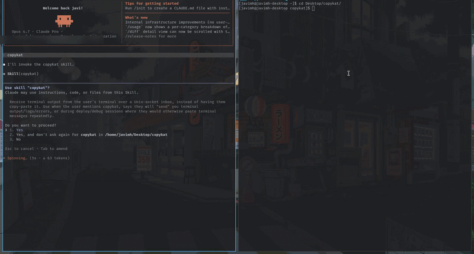

# copykat



Stop copy-pasting terminal output into your AI agent.

`copykat` records your shell's output to an in-memory ring buffer and gives you
a Textual viewer where one keystroke pushes a recorded command (its input *and*
its output) straight into the agent's chat over a Unix socket.

The agent runs `copykat listen` as a background watcher; each push arrives as a
notification. No clipboard, no truncation, no "paste the full traceback please".

> **Status:** beta. Linux/macOS. Bash gets full per-command splitting via OSC 133
> prompt markers; other shells record fine but show the whole session as one
> message.

## Install

```bash
git clone https://gitlab.com/javimh/copykat.git
cd copykat
./install.sh
```

The installer:

- copies the skill payload into `~/.copykat/`,
- symlinks it into every detected agent (Claude Code, OpenCode, Codex),
- puts the `copykat` CLI on your `$PATH` via `uv`, then `pipx`, then `pip --user`,
- optionally adds a shell-rc hook so every new terminal auto-records.

Flags: `--all`, `--claude`, `--opencode`, `--codex`, `--path DIR`,
`--shell-hook` / `--no-shell-hook`, `--rc FILE`, `--list`, `--dry-run`.

## Use it

In your terminal:

```bash
copykat record       # wraps your shell; recording starts now
copykat              # opens the viewer (alias for `copykat viewer`)
```

In the viewer:

| key       | action                                          |
| --------- | ----------------------------------------------- |
| `↑` / `↓` | move                                            |
| `e`       | expand the selected message full-screen         |
| `space`   | mark for multi-send                             |
| `s`       | send the selected (or marked) recording         |
| `q`       | quit                                            |

In the agent, start a listener so messages land as notifications:

```bash
copykat listen --who "claude-code" --session "debug-auth"
```

When you press `s` in the viewer, it shows a git-commit-style compose screen.
Write a note, `ctrl+s` sends. The agent gets your note + the recorded output.

## How it works

```
   your terminal                    agent
   ─────────────                    ─────
   copykat record  ─ records ─→  ring buffer  ──┐
                                                │ (request/reply)
   copykat viewer  ←── reads ──── ring buffer ──┘
        │
        │  (push, JSONL over AF_UNIX)
        ↓
   /tmp/copykat:watcher:<who>:<session>.sock
        ↑
   copykat listen ─ stdout lines ─→ Monitor notifications
```

- **`copykat record`** spawns your shell under a PTY, taps the *outbound*
  stream (your keystrokes are forwarded but never recorded, so passwords at
  no-echo prompts can't leak), and parses bytes into a ring buffer of `Message`
  objects.
- **OSC 133 prompt markers** are injected into the bash it launches, so each
  shell prompt brackets one command + its output as a single message. With a
  non-bash shell, the whole session is one big message.
- **`copykat viewer`** is a Textual app that polls the recorder's socket and
  pushes the selected message(s) to a `copykat listen` inbox. The viewer's own
  output is bracketed with `OSC 666` markers and the recorder mutes anything
  between them, so there's no feedback loop when running inside its own
  recorded shell.
- **`copykat listen`** is a tiny Unix-socket server that prints every message
  it receives. Run it under the agent's Monitor tool so each message becomes
  a notification.

## Security

- Sockets are created with mode `0600` (owner-only).
- Only PTY *output* is recorded; stdin is forwarded but never tapped.
- Stale-socket detection refuses to overwrite a live recorder/inbox.
- Nesting prevention: `copykat record` refuses to start inside an already-
  recorded session (the spawned shell exports `$COPYKAT_SOCKET`).

## Theme

Drop a `theme.yaml` next to the install or edit `~/.copykat/theme.yaml`. See
the file in this repo for the schema (background/foreground/accent/notice).

## License

GPL-3.0-or-later. See [LICENSE](LICENSE).
